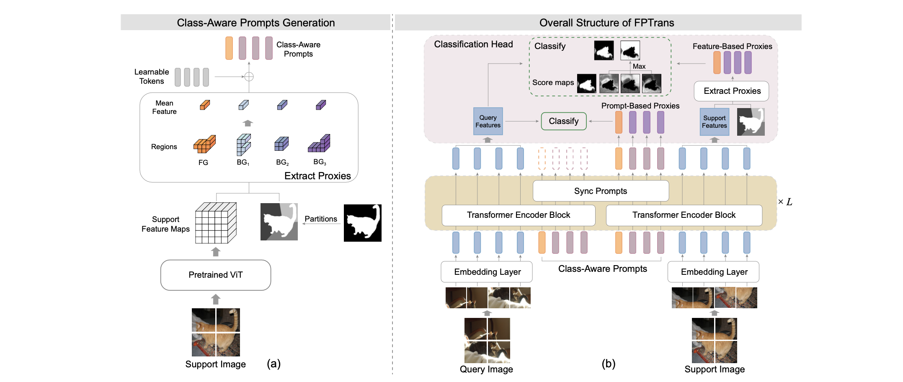

# FPTrans: Feature-Proxy Transformer for Few-Shot Segmentation

[Jian-Wei Zhang](https://github.com/Jarvis73), Yifan Sun, Yi Yang, Wei Chen

[[arXiv](https://arxiv.org/abs/2210.06908)][[Bibtex](https://github.com/Jarvis73/FPTrans#CitingFPTrans)]

This repository is the PaddlePaddle Implementation. One can find the PyTorch implementation from [here](https://github.com/Jarvis73/FPTrans).



## FPTrans-Paddle

## Installation

Create a virtual environment and install the required packages.

```bash
conda create -n fptrans_paddle python=3.9.7
conda activate fptrans_paddle
conda install paddlepaddle-gpu==2.3.2 cudatoolkit=11.2 -c https://mirrors.tuna.tsinghua.edu.cn/anaconda/cloud/Paddle/ -c conda-forge
conda install tqdm scipy
pip install git+https://github.com/IDSIA/sacred.git@0.8.3
pip install pycocotools opencv-python
```

Put following bash function in `~/.bashrc` for simplifying the `CUDA_VISIBLE_DEVICES`. 

```bash
function cuda()
{
    if [ "$#" -eq 0 ]; then
        return
    fi
    GPU_ID=$1
    shift 1
    CUDA_VISIBLE_DEVICES="$GPU_ID" $@
}
```

Now we can use `cuda 0 python` for single GPU and `cuda 0,1 python` for multiple GPUs. 

## Getting Started

See [Preparing Datasets and Pretrained Backbones for FPTrans](./data/README.md)

### Usage for inference with our pretrained models

Download the checkpoints of our pretrained FPTrans from [GoogleDrive]() or [Baidu]().


### Usage for training from scratch


### Performance

* Results on PASCAL-5i

|   Backbone    | Method  |  1-shot  |  5-shot  |
|:-------------:|:-------:|:--------:|:--------:|
|   ResNet-50   |  HSNet  |   64.0   |   69.5   |
|               |   BAM   |   67.8   |   70.9   |
| ViT-B/16-384  | FPTrans |   64.7   |   73.7   |
|   DeiT-T/16   | FPTrans |   59.7   |   68.2   |
|   DeiT-S/16   | FPTrans |   65.3   |   74.2   |
| DeiT-B/16-384 | FPTrans | **68.8** | **78.0** |

* Results on COCO-20i

|   Backbone    | Method  |  1-shot  |  5-shot  |
|:-------------:|:-------:|:--------:|:--------:|
|   ResNet-50   |  HSNet  |   39.2   |   46.9   |
|               |   BAM   |   46.2   |   51.2   |
| ViT-B/16-384  | FPTrans |   42.0   |   53.8   |
| DeiT-B/16-384 | FPTrans | **47.0** | **58.9** |

Notice that the results are obtained on NVIDIA A100/V100 platform. We find that the results
may have a little difference on NVIDIA GeForce 3090 with exactly the same model and environment.

## Citing FPTrans

```text
@inproceedings{zhang2022FPTrans,
  title={Feature-Proxy Transformer for Few-Shot Segmentation},
  author={Jian-Wei Zhang, Yifan Sun, Yi Yang, Wei Chen},
  journal={NeurIPS},
  year={2022}
}
```
